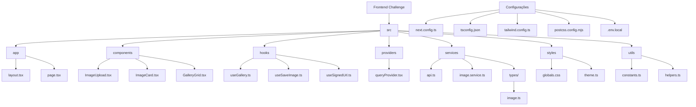

# Projeto Frontend Challenge

Uma aplicação web para envio e listagem de imagens usando Next.js, TypeScript, MUI e React Query.

## Estrutura do Projeto



## 🚀 Tecnologias Utilizadas

- Next.js
- TypeScript
- MUI
- React Query

## ⚙️ Pré-requisitos

Antes de começar, você precisa ter instalado em sua máquina:

- Node.js (versão 18.0 ou superior)
- npm ou yarn

# Configuração do Ambiente

1. Clone o repositório

2. Entre no diretório do projeto

```bash
cd frontend-challenge
```

3. Instale as dependências

```bash
npm install
# ou
yarn install
```

4. Copie o arquivo de ambiente:

```bash
cp .env.example .env.local
```

5. As variáveis padrão já estão configuradas e prontas para uso

```bash
NEXT_PUBLIC_API_TOKEN=frontend-challenge-gabriel-salvador
NEXT_PUBLIC_API_URL=https://frontend-challenge-backend-842303020925.us-east1.run.app
```

6. Inicie o servidor de desenvolvimento

```bash
npm run dev
# ou
yarn dev
```

## 🎯 Funcionalidades

- Upload de imagens com preview
- Suporte para formatos PNG, JPG e GIF
- Limite de tamanho de arquivo (5MB)
- Galeria de imagens com scroll infinito
- Layout responsivo
- Loading states e feedback visual
- Persistência de dados via API
- Integração com Google Cloud Storage

## 🧪 Como Testar

1. Após iniciar o servidor de desenvolvimento, acesse `http://localhost:3000` no seu navegador

2. Para testar as funcionalidades:
   - Faça upload de uma imagem arrastando um arquivo ou clicando no campo de upload
   - Visualize o preview da imagem antes do envio
   - Envie a imagem e veja ela aparecer na galeria
   - Scroll até o final da página para carregar mais imagens
   - Teste o layout responsivo em diferentes tamanhos de tela

## 🔒 Configuração do Projeto

O projeto utiliza as seguintes configurações:

- Next.js com App Router
- Material-UI com tema personalizado dark
- React Query para gerenciamento de estado e cache
- Integração com API RESTful
- Configuração de domínios permitidos para o Next Image
- ESLint com configurações para Next.js e TypeScript

## 🤝 Contribuindo

1. Faça um fork do projeto
2. Crie uma branch para sua feature (`git checkout -b feature/AmazingFeature`)
3. Faça commit das suas alterações (`git commit -m 'Add some AmazingFeature'`)
4. Faça push para a branch (`git push origin feature/AmazingFeature`)
5. Abra um Pull Request

## 📝 Licença

Este projeto está sob a licença MIT. Veja o arquivo [LICENSE](LICENSE) para mais detalhes.

## 📬 Contato

Gabriel Salvador - [gabriel.ssalvador97@gmail.com](mailto:seu-email@exemplo.com)

Link do projeto: [https://github.com/seu-usuario/frontend-challenge](https://github.com/seu-usuario/frontend-challenge)

---

Por [Gabriel Salvador]
